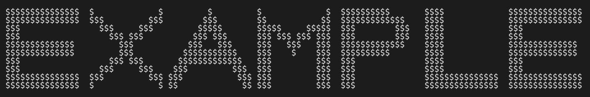

# Print it!

## Overview

Print it allows you to display phrases in large text on the console.  
The logic for using the script is straightforward and can be found in `main.cpp`.

## Running the Project

To compile and run the script, use the following commands:
```bash
g++ -std=c++20 main.cpp Phrase/Phrase.cpp Lettre/Lettre.cpp -o main
```
```bash
./main
```

## Examples

> 

> 
